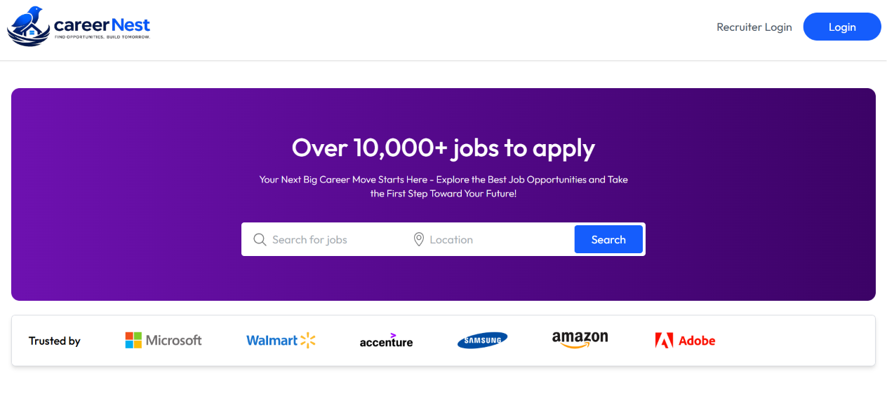
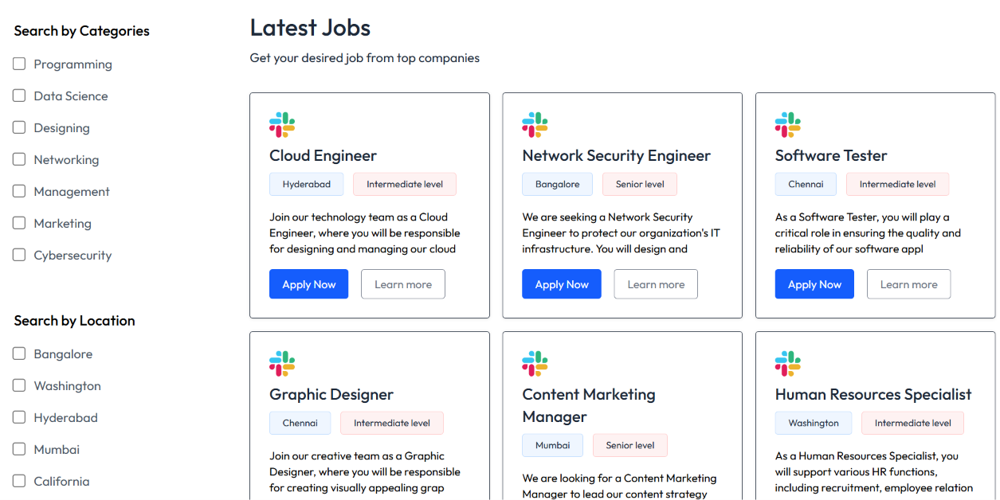
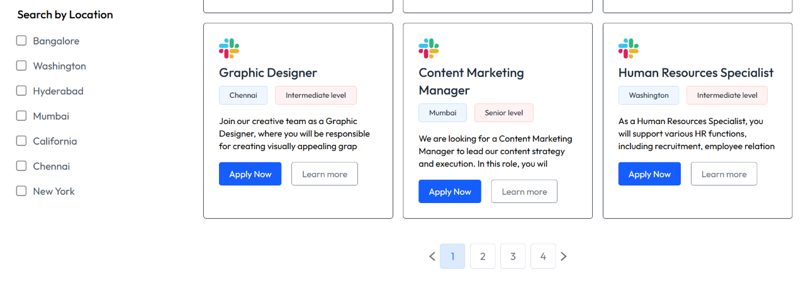
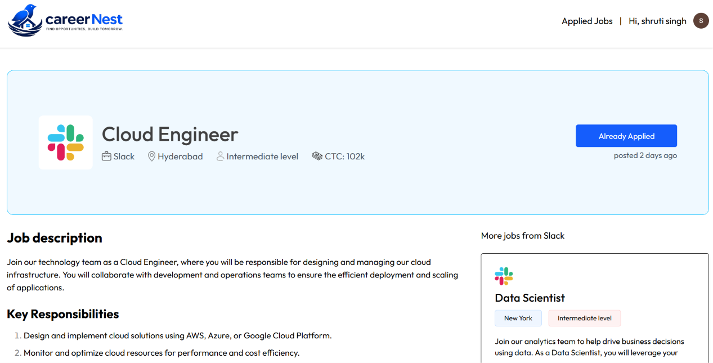
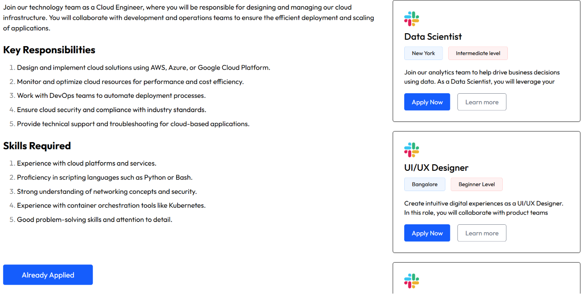
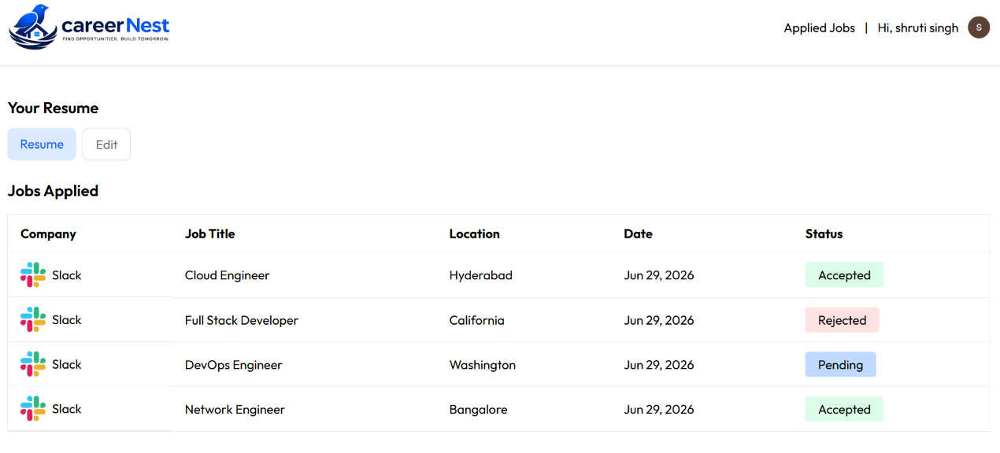
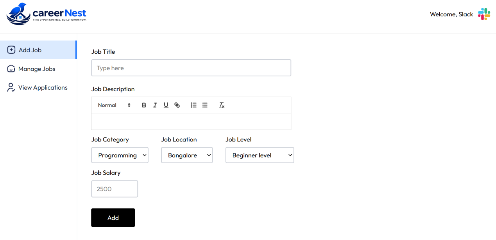
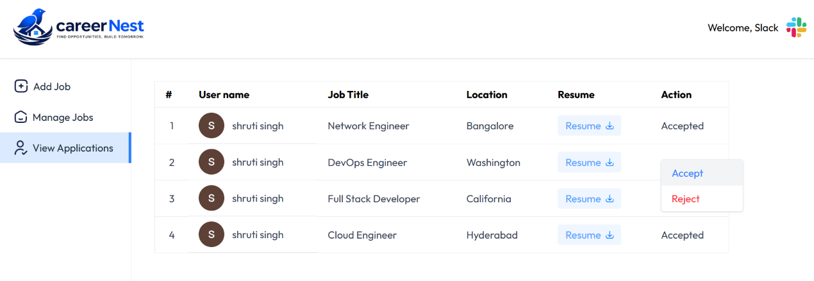

# 🚀 CareerNest

CareerNest is a full-stack job portal that bridges the gap between job seekers and recruiters. It provides a seamless hiring experience with secure authentication, resume management, job applications, recruiter dashboards, and application tracking through a modern, responsive interface.

---

## 🌐 Live Demo

🔗 **Website:** https://careernest-client-ecru.vercel.app

🔗 **Backend API:** https://careernest-server.vercel.app

---

## 🎥 Demo Video

Watch the complete project walkthrough here:

**📹 https://drive.google.com/file/d/1beTtR69l3ECjYAXvxl9UErThd76XTlTY/view?usp=drive_link**


---

# 📸 Project Screenshots

## Home Page








---

## Job Details





---

## Applications Page



---

## Recruiter Dashboard

---

## Add Job



---

## Manage Jobs Page


---

## Update Application Status



---

# ✨ Features

## 👨‍💼 Job Seeker

- Secure authentication using Clerk
- Browse all available jobs
- Search and filter jobs by title and location
- Upload and update resume
- Apply for jobs
- Prevent duplicate applications
- Track application status
- View application history

---

## 🏢 Recruiter

- JWT-based recruiter authentication
- Recruiter dashboard
- Create new job postings
- View all posted jobs
- View applicants
- Update application status

---

## 🎨 User Experience

- Responsive UI
- Clean modern design
- Toast notifications
- Loading states
- Empty state messages

---

# 🛠️ Tech Stack

### Frontend

- React.js
- Vite
- Tailwind CSS
- React Router DOM
- Axios
- Clerk Authentication
- React Toastify
- Context API

### Backend

- Node.js
- Express.js
- MongoDB Atlas
- Mongoose
- JWT Authentication
- Clerk Webhooks
- Multer
- Cloudinary

### Deployment

- Vercel
- MongoDB Atlas

---

# 📂 Folder Structure

```
CareerNest
│
├── client
├── server
├── screenshots
├── README.md
└── .gitignore
```

---

# ⚙️ Installation

Clone the repository

```bash
git clone https://github.com/shruti240104/careernest.git
```

Install frontend

```bash
cd client
npm install
npm run dev
```

Install backend

```bash
cd server
npm install
npm run server
```

---

# 🔑 Environment Variables

### Frontend

```env
VITE_BACKEND_URL=
VITE_CLERK_PUBLISHABLE_KEY=
```

### Backend

```env
JWT_SECRET=
MONGODB_URI=
CLERK_SECRET_KEY=
CLERK_WEBHOOK_SECRET=
JWT_SECRET=
CLOUDINARY_NAME=
CLOUDINARY_API_KEY=
CLOUDINARY_SECRET_KEY=
```

---

# 🚀 Future Improvements

- Saved Jobs
- AI Resume Matching
- Email Notifications
- Interview Scheduling
- Recruiter Analytics

---

# 👩‍💻 Author

**Shruti Singh**

GitHub:
https://github.com/shruti240104

LinkedIn:
https://www.linkedin.com/in/shrutisingh24/

---

⭐ If you like this project, don't forget to give it a star!